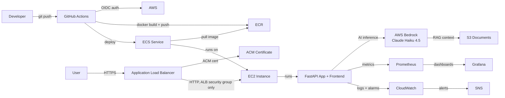
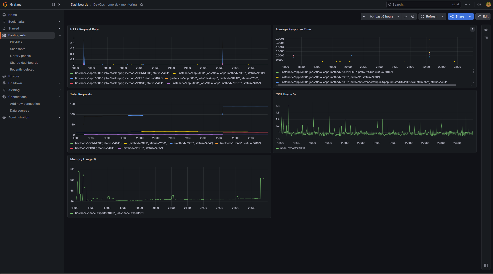

# DevOps Home Lab

End-to-end DevOps pipeline built for learning and portfolio purposes.

## Status

Phase 4 complete. Phase 5 in progress — ALB/HTTPS and frontend complete, multi-environment Terraform workspaces remaining.

## Architecture

Every push to `main` triggers the GitHub Actions CI/CD pipeline. Actions authenticates to AWS via OIDC (no stored credentials), builds the Docker image, pushes it to ECR, then triggers an ECS service update — ECS pulls the latest image and redeploys automatically. An Application Load Balancer fronts the ECS service, terminating HTTPS with an ACM-issued certificate and routing to the EC2 instance over HTTP internally; the EC2 security group only accepts traffic on that port from the ALB itself. The FastAPI app serves a server-rendered frontend (home page and an interactive AI chat page) alongside its REST API, including a `/ask` endpoint backed by AWS Bedrock (Claude Haiku 4.5) using S3 documents as RAG context. Prometheus scrapes app and system metrics which Grafana visualizes in real time. CloudWatch handles AWS-level alerting via SNS.

## Stack

- **Terraform** — AWS infrastructure provisioning with reusable modules (vpc, ec2, security_group, ecr, iam, ecs, alb, s3, cloudwatch)
- **Ansible** — server configuration + security hardening
- **Docker** — app containerization
- **GitHub Actions** — CI/CD pipeline (builds image, pushes to ECR, deploys to ECS via OIDC — no stored AWS credentials)
- **AWS ECR** — private Docker image registry
- **AWS ECS** — container orchestration (EC2 launch type)
- **AWS ALB** — Application Load Balancer with HTTPS termination (ACM certificate, auto HTTP→HTTPS redirect)
- **AWS ACM** — managed TLS certificate, DNS-validated
- **AWS Bedrock** — Claude Haiku 4.5 AI endpoint with RAG pattern over S3 documents
- **AWS S3** — document storage for RAG pattern
- **AWS CloudWatch** — ECS metrics, log aggregation, CPU/memory/task alarms via SNS
- **FastAPI** — Python REST API with auto-generated Swagger docs and Pydantic validation; also serves a server-rendered frontend via Jinja2
- **Prometheus** — metrics collection (app metrics via `prometheus-fastapi-instrumentator`, host metrics via node-exporter)
- **Grafana** — monitoring dashboards (HTTP request rate, average response time, total requests, CPU, memory)
- **Cloudflare** — DNS for custom domain (`devops.gavinalan.com`)

## Phases

- [x] Phase 1: Repo setup + Terraform + Ansible
- [x] Phase 2: Docker + GitHub Actions CI/CD
- [x] Phase 3: Monitoring (Prometheus + Grafana)
- [x] Phase 4: GenAI layer (AWS Bedrock + FastAPI + ECR/ECS)
  - [x] Flask to FastAPI migration
  - [x] Terraform refactor to reusable modules
  - [x] AWS ECR — Docker image registry
  - [x] IAM OIDC — keyless GitHub Actions authentication
  - [x] AWS ECS — container orchestration
  - [x] AWS Bedrock — RAG endpoint (Claude Haiku 4.5)
  - [x] AWS CloudWatch — alarms and log aggregation
- [ ] Phase 5: Production hardening
  - [x] Application Load Balancer with HTTPS (ACM cert, DNS validation via Cloudflare)
  - [x] EC2 security group locked down to ALB-only on app port
  - [x] Prometheus scrape config fixed to target live app metrics endpoint
  - [x] ECS container health check migrated off `curl` (not present in slim base image) to a Python-native check
  - [x] Frontend for /ask endpoint — home page + interactive chat UI, server-rendered via Jinja2
  - [ ] Multi-environment Terraform workspaces (dev/staging/prod)
  - [ ] Monitoring stack migrated to ECS
  - [ ] Automate monitoring config sync to EC2 (currently manual `scp`; candidate for Ansible playbook)

## Pages

- **/** — Home page: project overview, architecture summary, live Grafana metrics
- **/chat** — Interactive AI assistant UI (calls `/ask`)

## API Endpoints

- **GET /api/info** — App info (JSON)
- **GET /health** — Health check (used by ECS)
- **GET /metrics** — Prometheus metrics
- **POST /ask** — AI endpoint (AWS Bedrock + Claude Haiku 4.5)
- **GET /docs** — Swagger UI

## Live Endpoints

- App: https://devops.gavinalan.com
- AI Assistant: https://devops.gavinalan.com/chat
- Swagger Docs: https://devops.gavinalan.com/docs
- Grafana: http://107.21.212.161:3000
- Prometheus: http://107.21.212.161:9090
- Metrics: https://devops.gavinalan.com/metrics

> Note: instance may be stopped periodically to manage costs — endpoints available on request.

## Monitoring Dashboard

